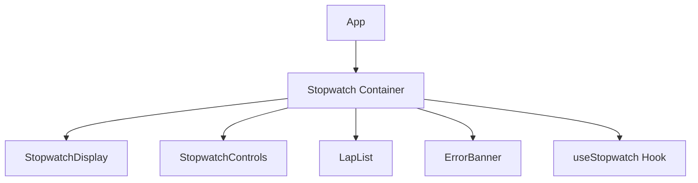
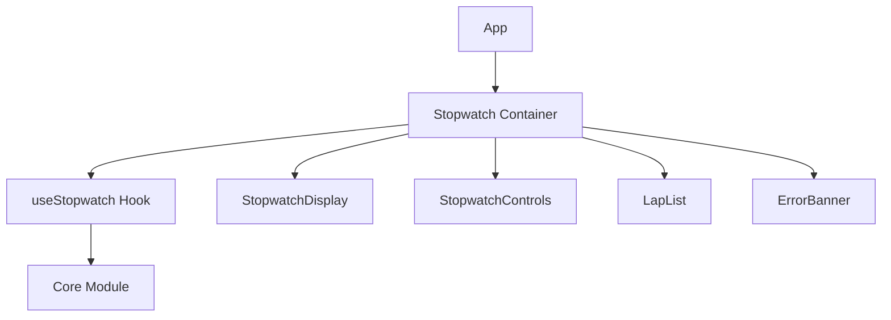

# Phase 12 Implementation Plan: Complete Verification & Enhancements

**Date**: Implementation Plan Created  
**Status**: Ready to Execute  
**Total Effort**: ~2 hours  
**Priority**: ⚠️ **MEDIUM** - Enhancements and verification, not blocking

---

## Executive Summary

This implementation plan addresses the minor gaps and enhancement opportunities identified in the Phase 12 Investigation Report. All tasks are non-blocking and focus on verification, consistency improvements, and best practice enhancements.

### Implementation Tiers

```
TIER 1: VERIFICATION TASKS (30 min) - Must complete
  ☐ 1.1 Fix naming inconsistency (index.html → index.tsx)
  ☐ 1.2 Generate and verify coverage reports
  ☐ 1.3 Verify E2E tests run successfully

TIER 2: ENHANCEMENTS (90 min) - Should complete
  ☐ 2.1 Add visual documentation to README files
  ☐ 2.2 Extract shared app styles
  ☐ 2.3 Add CI/CD integration for coverage and E2E tests

TIER 3: BEST PRACTICES (30 min) - Nice to have
  ☐ 3.1 Add automated accessibility testing
  ☐ 3.2 Add architecture diagrams
  ☐ 3.3 Create deployment guide
```

---

## TIER 1: Verification Tasks (30 minutes)

### Task 1.1: Fix Naming Inconsistency (5 minutes)

**Issue**: `index.html` references `/src/main.tsx` but actual file is `index.tsx`

**Files to Update**:
- `apps/stopwatch/ui/index.html`
- `apps/temp/ui/index.html`

**Action**:
1. Update `index.html` to reference `index.tsx` instead of `main.tsx`
2. Verify both UIs still build and run correctly

**Implementation**:

```html
<!-- apps/stopwatch/ui/index.html -->
<!-- BEFORE -->
<script type="module" src="/src/main.tsx"></script>

<!-- AFTER -->
<script type="module" src="/src/index.tsx"></script>
```

```html
<!-- apps/temp/ui/index.html -->
<!-- BEFORE -->
<script type="module" src="/src/main.tsx"></script>

<!-- AFTER -->
<script type="module" src="/src/index.tsx"></script>
```

**Verification**:
```bash
# Stopwatch UI
cd apps/stopwatch/ui
npm run build
npm run dev  # Verify app loads correctly

# Temp UI
cd apps/temp/ui
npm run build
npm run dev  # Verify app loads correctly
```

**Success Criteria**:
- ✅ Both UIs build without errors
- ✅ Both UIs load correctly in browser
- ✅ No console errors

---

### Task 1.2: Generate and Verify Coverage Reports (15 minutes)

**Issue**: Coverage reports may not be generated yet, thresholds not verified

**Action**:
1. Generate coverage reports for both UIs
2. Verify coverage thresholds are met (≥50%)
3. Document actual coverage percentages
4. Update COVERAGE_REPORT.md with actual numbers

**Implementation**:

**Step 1: Generate Coverage Reports**

```bash
# Stopwatch UI
cd apps/stopwatch/ui
npm run test:coverage -- --run

# Temp UI
cd apps/temp/ui
npm run test:coverage -- --run
```

**Step 2: Verify Coverage Thresholds**

Check `coverage/index.html` in both directories:
- Statements: Should be ≥50%
- Branches: Should be ≥50%
- Functions: Should be ≥50%
- Lines: Should be ≥50%

**Step 3: Document Coverage**

Update `apps/stopwatch/ui/COVERAGE_REPORT.md`:
```markdown
## Current Coverage (Generated: [DATE])

| Metric | Target | Actual | Status |
|--------|--------|--------|--------|
| Statements | ≥50% | [ACTUAL]% | ✅/⚠️ |
| Branches | ≥50% | [ACTUAL]% | ✅/⚠️ |
| Functions | ≥50% | [ACTUAL]% | ✅/⚠️ |
| Lines | ≥50% | [ACTUAL]% | ✅/⚠️ |
```

Update `apps/temp/ui/COVERAGE_REPORT.md` similarly.

**Step 4: If Coverage Below Threshold**

If any metric is below 50%, identify gaps:
1. Review coverage report to identify uncovered lines
2. Add tests for uncovered code paths
3. Re-run coverage to verify improvement

**Success Criteria**:
- ✅ Coverage reports generated successfully
- ✅ All coverage metrics ≥50%
- ✅ Coverage documented in COVERAGE_REPORT.md
- ✅ HTML reports accessible at `coverage/index.html`

---

### Task 1.3: Verify E2E Tests Run Successfully (10 minutes)

**Issue**: E2E tests not verified to run successfully

**Action**:
1. Run E2E tests for both UIs
2. Verify all tests pass
3. Document any issues
4. Fix any failures

**Implementation**:

**Step 1: Run E2E Tests**

```bash
# Stopwatch UI
cd apps/stopwatch/ui
npm run e2e

# Temp UI
cd apps/temp/ui
npm run e2e
```

**Step 2: Verify Test Execution**

Check for:
- ✅ All tests pass
- ✅ No timeout errors
- ✅ No browser launch errors
- ✅ Proper test isolation

**Step 3: Document Results**

Create `apps/stopwatch/ui/E2E_TEST_RESULTS.md`:
```markdown
# E2E Test Results

**Date**: [DATE]
**Status**: ✅ All tests passing / ⚠️ Some failures

## Test Results

| Test | Status | Duration | Notes |
|------|--------|----------|-------|
| Complete workflow | ✅ Pass | [TIME] | - |
| Error handling | ✅ Pass | [TIME] | - |
| Format verification | ✅ Pass | [TIME] | - |
```

Create similar file for Temp UI.

**Step 4: Fix Any Failures**

If tests fail:
1. Review error messages
2. Check Playwright configuration
3. Verify webServer auto-start works
4. Fix test issues
5. Re-run tests

**Common Issues**:
- **Timeout errors**: Increase timeout in playwright.config.ts
- **Browser launch errors**: Verify Playwright browsers installed (`npx playwright install`)
- **WebServer errors**: Verify dev server starts correctly

**Success Criteria**:
- ✅ All E2E tests pass
- ✅ No timeout or browser errors
- ✅ Test results documented
- ✅ Any failures fixed

---

## TIER 2: Enhancements (90 minutes)

### Task 2.1: Add Visual Documentation to README Files (30 minutes)

**Enhancement**: Add screenshots and architecture diagrams to README files

**Action**:
1. Create screenshots of both UIs
2. Add architecture diagrams
3. Update README files with visuals

**Implementation**:

**Step 1: Create Screenshots**

Take screenshots of:
- Stopwatch UI: Initial state, running state, with laps
- Temp Converter UI: Initial state, conversion result, error state

Save to:
- `apps/stopwatch/ui/docs/screenshots/`
- `apps/temp/ui/docs/screenshots/`

**Step 2: Create Architecture Diagrams**

Create diagrams showing:
- Component hierarchy
- State flow
- Data flow

Use Mermaid syntax in README:

```markdown
## Architecture


```

**Step 3: Update README Files**

Add sections:
- Screenshots section with images
- Architecture section with diagrams
- Visual examples

**Success Criteria**:
- ✅ Screenshots added to README
- ✅ Architecture diagrams added
- ✅ Visual examples included
- ✅ Documentation enhanced

---

### Task 2.2: Extract Shared App Styles (15 minutes)

**Enhancement**: Extract common app styles to shared constants

**Action**:
1. Create shared styles file
2. Extract common styles from App.tsx files
3. Update App.tsx to use shared styles

**Implementation**:

**Step 1: Create Shared Styles**

Create `apps/stopwatch/ui/src/styles/appStyles.ts`:
```typescript
export const appStyles = {
  container: {
    minHeight: '100vh',
    backgroundColor: '#f9f9f9',
    fontFamily: 'system-ui, -apple-system, sans-serif',
  },
} as const;
```

Create similar for Temp UI.

**Step 2: Update App.tsx**

```typescript
import { appStyles } from './styles/appStyles';

function App() {
  return (
    <div className="stopwatch-app" style={appStyles.container}>
      <Stopwatch />
    </div>
  );
}
```

**Success Criteria**:
- ✅ Shared styles extracted
- ✅ App.tsx uses shared styles
- ✅ Styles consistent between UIs
- ✅ No visual regressions

---

### Task 2.3: Add CI/CD Integration for Coverage and E2E Tests (45 minutes)

**Enhancement**: Add coverage reports and E2E tests to CI/CD pipeline

**Action**:
1. Add coverage report generation to CI
2. Add E2E test execution to CI
3. Add coverage threshold checks
4. Add E2E test result reporting

**Implementation**:

**Step 1: Update CI Workflow**

Add to `.github/workflows/ci.yml` or create new workflow:

```yaml
name: UI Tests and Coverage

on:
  push:
    branches: [main, development]
  pull_request:
    branches: [main, development]

jobs:
  stopwatch-ui:
    runs-on: ubuntu-latest
    steps:
      - uses: actions/checkout@v3
      - uses: actions/setup-node@v3
        with:
          node-version: '18'
      - name: Install dependencies
        run: |
          cd apps/stopwatch/ui
          npm ci
      - name: Run tests with coverage
        run: |
          cd apps/stopwatch/ui
          npm run test:coverage -- --run
      - name: Upload coverage
        uses: codecov/codecov-action@v3
        with:
          file: ./apps/stopwatch/ui/coverage/lcov.info
      - name: Install Playwright
        run: |
          cd apps/stopwatch/ui
          npx playwright install --with-deps
      - name: Run E2E tests
        run: |
          cd apps/stopwatch/ui
          npm run e2e

  temp-ui:
    runs-on: ubuntu-latest
    steps:
      # Similar steps for Temp UI
```

**Step 2: Add Coverage Threshold Checks**

Ensure coverage thresholds are enforced:
```yaml
- name: Check coverage thresholds
  run: |
    cd apps/stopwatch/ui
    npm run test:coverage -- --run --coverage.thresholds.lines=50 --coverage.thresholds.branches=50 --coverage.thresholds.functions=50 --coverage.thresholds.statements=50
```

**Step 3: Add E2E Test Artifacts**

Upload E2E test results:
```yaml
- name: Upload E2E test results
  if: always()
  uses: actions/upload-artifact@v3
  with:
    name: e2e-results
    path: apps/stopwatch/ui/test-results/
```

**Success Criteria**:
- ✅ CI runs coverage reports
- ✅ CI runs E2E tests
- ✅ Coverage thresholds enforced
- ✅ Test results uploaded as artifacts

---

## TIER 3: Best Practices (30 minutes)

### Task 3.1: Add Automated Accessibility Testing (30 minutes)

**Enhancement**: Add automated accessibility audits

**Action**:
1. Add axe-core to E2E tests
2. Add Lighthouse CI
3. Add accessibility test reports

**Implementation**:

**Step 1: Add axe-core to E2E Tests**

Install dependencies:
```bash
npm install --save-dev @axe-core/playwright
```

Update E2E tests:
```typescript
import { injectAxe, checkA11y } from 'axe-playwright';

test('should have no accessibility violations', async ({ page }) => {
  await page.goto('/');
  await injectAxe(page);
  await checkA11y(page);
});
```

**Step 2: Add Lighthouse CI**

Add to CI workflow:
```yaml
- name: Run Lighthouse CI
  run: |
    npm install -g @lhci/cli
    lhci autorun
```

Create `lighthouserc.js`:
```javascript
module.exports = {
  ci: {
    collect: {
      url: ['http://localhost:5173'],
      startServerCommand: 'npm run dev',
    },
    assert: {
      assertions: {
        'categories:accessibility': ['error', { minScore: 0.9 }],
      },
    },
  },
};
```

**Success Criteria**:
- ✅ Accessibility tests run automatically
- ✅ Accessibility violations detected
- ✅ Reports generated
- ✅ CI integration complete

---

### Task 3.2: Add Architecture Diagrams (Optional)

**Enhancement**: Add detailed architecture diagrams

**Action**:
1. Create component hierarchy diagrams
2. Create state flow diagrams
3. Create data flow diagrams

**Implementation**:

Use Mermaid syntax in README or create separate docs:

```markdown
## Component Architecture


```

**Success Criteria**:
- ✅ Architecture diagrams added
- ✅ Diagrams clear and accurate
- ✅ Documentation enhanced

---

### Task 3.3: Create Deployment Guide (Optional)

**Enhancement**: Add deployment instructions

**Action**:
1. Document build process
2. Document deployment steps
3. Document environment variables
4. Document production considerations

**Implementation**:

Create `DEPLOYMENT.md`:
```markdown
# Deployment Guide

## Prerequisites
- Node.js 18+
- npm 9+

## Build Process
1. Install dependencies: `npm ci`
2. Build: `npm run build`
3. Test: `npm run test -- --run`
4. E2E: `npm run e2e`

## Deployment Steps
1. Build production bundle
2. Deploy to hosting platform
3. Configure environment variables
4. Verify deployment

## Production Considerations
- Enable production mode
- Configure CDN
- Set up monitoring
- Configure error tracking
```

**Success Criteria**:
- ✅ Deployment guide created
- ✅ Build process documented
- ✅ Production considerations documented

---

## Verification Checklist

After completing all tasks, verify:

- [ ] Naming inconsistency fixed (index.html → index.tsx)
- [ ] Coverage reports generated and verified (≥50%)
- [ ] E2E tests run successfully
- [ ] Visual documentation added to README
- [ ] Shared styles extracted
- [ ] CI/CD integration added
- [ ] Automated accessibility testing added
- [ ] Architecture diagrams added (optional)
- [ ] Deployment guide created (optional)

---

## Success Criteria

Phase 12 is considered complete when:

1. ✅ All Tier 1 verification tasks complete
2. ✅ All Tier 2 enhancements implemented (or documented as deferred)
3. ✅ Coverage reports show ≥50% coverage
4. ✅ All E2E tests pass
5. ✅ Documentation enhanced with visuals
6. ✅ CI/CD integration working
7. ✅ No blocking issues remain

---

## Timeline Estimate

| Tier | Tasks | Estimated Time |
|------|-------|----------------|
| Tier 1 | Verification | 30 minutes |
| Tier 2 | Enhancements | 90 minutes |
| Tier 3 | Best Practices | 30 minutes (optional) |
| **Total** | | **2-2.5 hours** |

---

## Risk Assessment

**Low Risk**:
- All tasks are enhancements, not fixes
- No breaking changes
- Can be implemented incrementally

**Mitigation**:
- Test each change before moving to next
- Keep changes small and focused
- Verify no regressions after each change

---

## Conclusion

This implementation plan addresses all minor gaps and enhancement opportunities identified in Phase 12. All tasks are non-blocking and can be implemented incrementally. The plan prioritizes verification tasks first, followed by enhancements and best practices.

**Status**: Ready to Execute  
**Priority**: Medium (enhancements, not blocking)  
**Estimated Effort**: 2-2.5 hours

